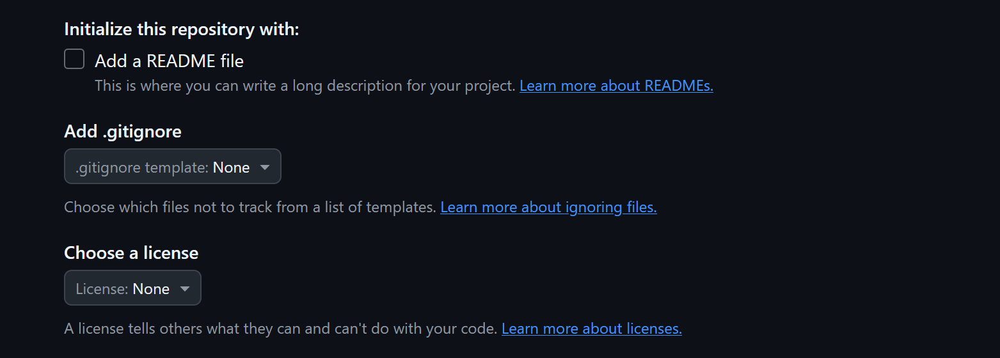
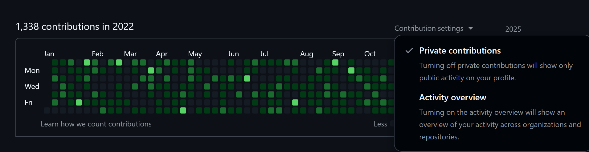

# github_contribution_feed  

**English** | [中文](./README_CN.md)  

**Fill in your past GitHub contribution graph with one click**  


---

## What this project does

This is a lightweight command-line tool that can **fill in missing GitHub contribution records for any year range you specify** in one go (it is not recommended to complete a year that has not yet ended).

**Highlights:**
- Operates on **a single repository only**, and the script automatically performs a `git pull` on that repo before running  
- Starts **January 1st of every year**, commits once per real calendar day (365/366 days), automatically detects leap years  
- Supports multiple runs and incremental appends (it never overwrites existing history)  
- **No temporary files** at any stage, minimizing disk I/O

---

## Getting started

### Prerequisites

- Python ≥ 3.7  
- Git is installed locally and the `git` command is available in your shell  

### 1️⃣ Download the script
```bash
git clone https://github.com/idiomeo/github_contribution_feed.git
cd github_contribution_feed
```

### 2️⃣ Create a new repository  
Create a new repo on GitHub.  
It is best **not** to initialize it with **README**, **.gitignore**, or **License** files, as shown below:  


The repo can be private.  
If you choose private, you **must** tick **Private Contributions** in your profile’s **Contribution settings**, as shown:  


### 3️⃣ One-click run  
Execute in your terminal:
```bash
python main.py
```  


When prompted, enter:
- Git username  
- Git email  
- Start year (cannot be earlier than 2008)  
- End year (cannot be earlier than 2008)  
- GitHub remote URL of the repo you just created  

If you only want to fill in one single year, set **Start year** and **End year** to the same value.

### 4️⃣ Wait for the script to finish

Because the script repeatedly calls `git commit` to forge the history, it will take some time.  
(If you worry about security due to the long runtime: the entire script is a **single file** of only **164 lines**, so you can review it quickly; **it is absolutely safe**.)

After a few minutes, your profile will be covered with green squares!  


---

(Re-running the script on the same repo and same date range will automatically append new commits without overwriting the old ones.)

---

## Disclaimer
- Usage is governed by the [**GPL 3.0** license](./LICENSE).  
- **GitHub officially prohibits abuse of the contribution graph; using this script may result in account suspension. The author assumes no responsibility for any direct or indirect consequences arising from the use of this script!**

---

**Enjoy your brand-new green wall!**