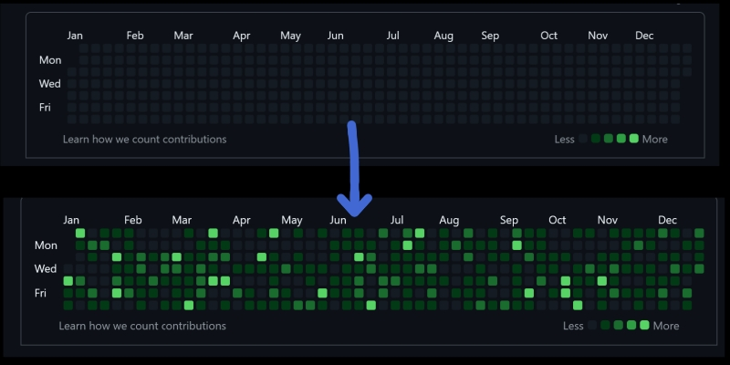
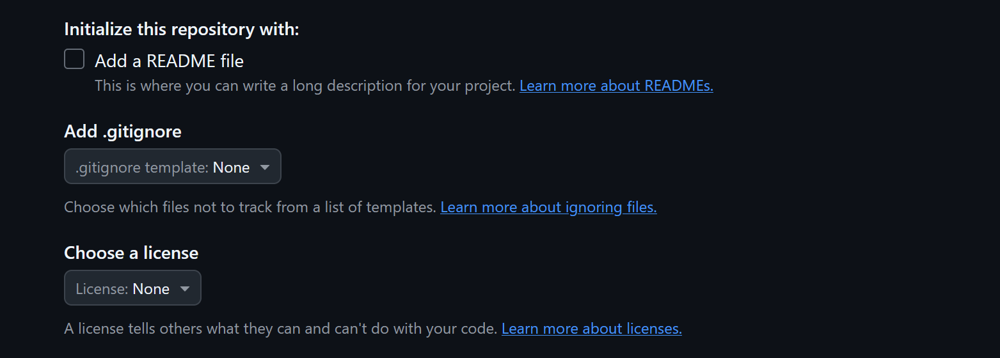
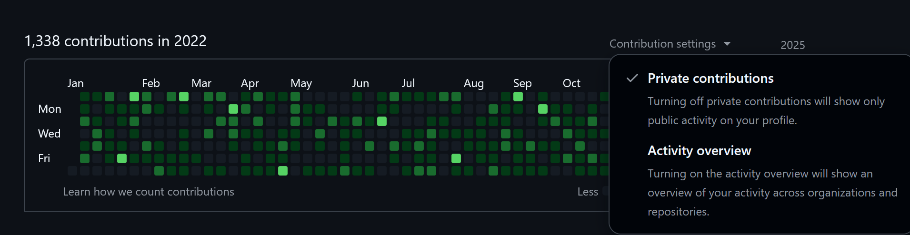
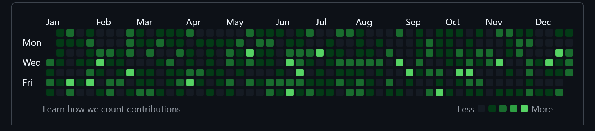

# Github贡献图补全脚本(github_contribution_feed)  

[English](./README.md) | **中文**   


**一键补全你的 GitHub 往年贡献图**  

---

## 项目作用
这是一个轻量级命令行工具，能够**根据你指定的年份范围**，**一次性补全**那些年缺失的 GitHub 贡献记录(不建议直接补完还未过完的年份)。  

**优点：**
- 只操作 **一个仓库**，且脚本执行时会自动对该仓库进行pull  
- 从 **每年 1 月 1 日** 开始，按真实日历（365/366 天）补 Commit，自动识别闰年  
- 支持多次运行、增量追加（即不会覆盖已有历史的追加）    
- 全程**无临时文件**，最大程度控制读写次数    

---

## 开始使用

### 使用前提

- Python ≥ 3.7  
- 本地已安装 Git 并可以在命令行直接使用**git**命令    


### 1️⃣ 下载脚本
```bash
git clone https://github.com/idiomeo/github_contribution_feed.git
cd github_contribution_feed
```

### 2️⃣ 新建仓库  
在Github上新建一个仓库  
最好不要勾选**README文件**，**.gitignore文件**以及**License文件**      
如图：  
  
  
  
仓库可以设置为私人仓库，  
但设置为私人仓库后必须在个人展示页面将**Contribution settings**中的**Private Contributions**给勾选上。    
如图：  
  
  

### 3️⃣ 一键运行  
在终端运行指令：
```bash
python main_cn.py
```  
（**main_cn.py**脚本中的提示语为中文，而**main.py**中的提示语则是英文，建议使用**main_cn.py**）  

按提示依次输入：
- Git 用户名  
- Git 邮箱    
- 起始年份（不可早于2008年）  
- 结束年份（不可早于2008年）  
- Github的远程仓库地址（你刚刚新建的Github仓库）  

如果你只想补交一年的贡献，那么**起始年份**与**结束年份**都填相同的年份即可

### 4️⃣ 等待脚本执行

由于该脚本需要通过反复调用git进行commit以伪造提交记录，因此你需要等待一段时间(等待时间与年份长短成正比)   

（如果你因为脚本执行时间过长而担心其安全问题：  
本脚本代码储存于**单文件**且只有**164行**，你可以随时进行快速审阅，**本脚本绝对安全**）  

脚本运行完成后，你的个人资料页就会出现大面积的“绿格子”啦！  
  

---  

（多次对同一仓库运行同一时间段会自动增量追加，不会覆盖原有提交）  

---  

## 声明
- 使用本仓库内容需遵循[**GPL3.0**协议](./LICENSE)。    
- **Github官方严禁贡献图滥用，使用该脚本有封号可能，本人对该脚本造成的任何直接或间接后果不负任何责任!**  

---

**祝你收获一整面绿墙！**